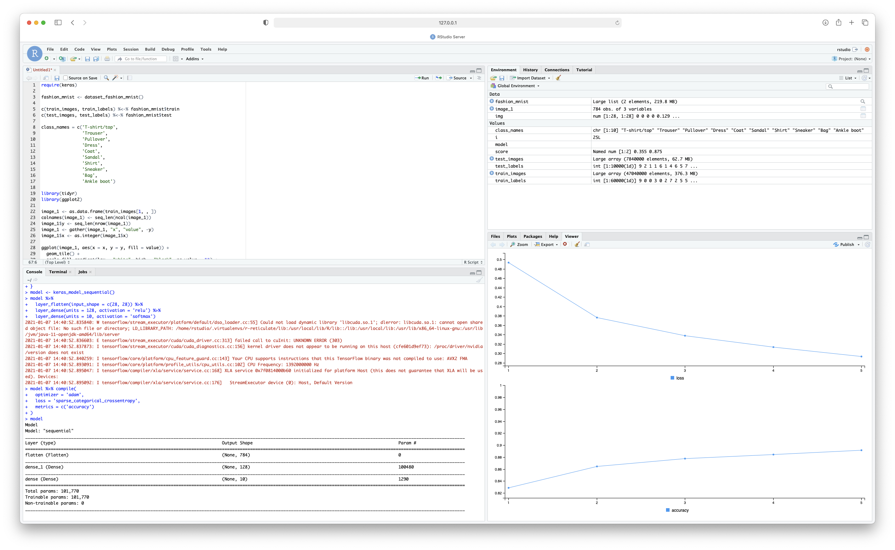
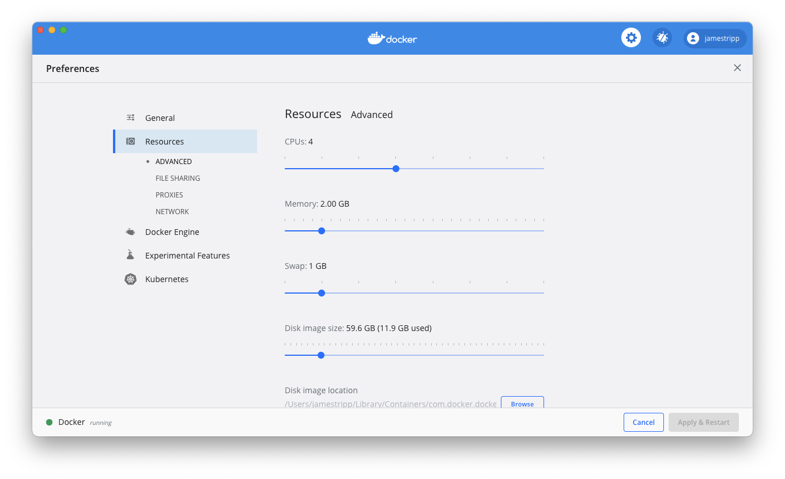

# R, RStudio, Keras in Docker

Here are instructions for installing a docker container (an isolated set of processes) within which runs R, RStudio server and Keras. 
This setup may be useful in case R and Keras are not working for you. **The size of the image is 5GB so do allow time to download the file**.

## Docker

We use the Docker program to setup our container. You can find an overview of Docker [here](https://docs.docker.com/get-started/overview/). 
To install Docker you can:

### Windows and MacOS

Install the Docker Desktop program from [here](https://www.docker.com/products/docker-desktop)

### Linux

Install docker from the Docker repositories (e.g., for Ubuntu see [here](https://docs.docker.com/engine/install/ubuntu/))

### MacOS

If you have [Homebrew](https://brew.sh) installed then run 

```bash
brew install --cask docker
```

## Downloading the image

You can download the image in two ways.

### From this repository

Download or clone this repository.

In your terminal program, go to the folder you have just downloaded and run

```bash
docker build --network=host -t r-keras-rstudio .
```

and you should see docker building the image. The images is up to a few GB and will take a while to download.

### From dockerhub

The docker image is available via dockerhub. Make sure you are logged into Docker with your Docker ID. Then type into the terminal.

```bash
docker pull jamestripp/r-keras-rstudio:tagname
```

The image is large and will take a while to download.

## Starting the image

Make sure you have download the image (see above) and then run in the terminal

```bash
docker run -d -p 8787:8787 -e PASSWORD="rstudio" r-keras-rstudio
```

The above command starts up a container using our r-keras-rstudio image. The container allows you to access the web interface of RStudio via port 8787 and has the password rstudio (you can change the password).

You can check the container is running by typing into the terminal

```bash
docker container list
```

and you should see something like.

```
CONTAINER ID   IMAGE             COMMAND   CREATED          STATUS          PORTS                    NAMES
cfe601d9ef73   r-keras-rstudio   "/init"   33 minutes ago   Up 33 minutes   0.0.0.0:8787->8787/tcp   musing_elbakyan
```

If you open your web browser and go to 127.0.0.1:8787 you will see.

Login using the username rstudio and the password rstudio. The RStudio web interface will be show. You can now run keras code within R using Tensorflow, like so.



## Caveats

This setup is suitable for running sample code if you are unable to run RKeras on your OS. However, there are several caveats.

* The performance will likely be worse within docker. The difference in performance is likely due to an additional abstraction (docker) and that the tensorflow options are not optimal for your machine.
* By default, the container has 2GB of RAM and ~50GB of disk space. This can be changed by going into Docker desktop and preferences (see below).
* The size of the docker image is rather large (~5GB). It may be possible in the future to reduce this.
* If you delete the container then you will lose your files. Uploading and downloading files to the container will need to be done via the RStudio web interface.

